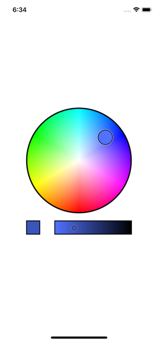

# ColourWheel

[](https://travis-ci.org/jdstmporter/ColourWheel)
[](https://cocoapods.org/pods/ColourWheel)
[](https://cocoapods.org/pods/ColourWheel)
[](https://cocoapods.org/pods/ColourWheel)

## API

ColourWheel defines a simple UIKit control that provides interactive colour-picker capability.  It is designable, so it works naturally with XCode's Interface Designer.  
It is implemented as a single class: `ColourWheelControl`, which inherits from `UIControl` and so exhibits all the usual configuration properties (e.g. background colour, border, `UIEvent`, etc).

Specific aspects of the API for `ColourWheelControl` that are of importance are as follows:

*  Reading  `var colour : UIColor` gives the currently selected colour, writing to it resets the control to point at the specified colour; this property is exposed to Interface Builder
*  The control fires the event  `UIEvent.valueChanged` whenever the selected colour changes; events are managed in the usual manner for `UIControl` instances

Everything else, including layout, is managed by the control.


## Example

To run the example project, clone the repo, and run `pod install` from the Example directory first.



## Requirements

## Installation

ColourWheel is available through [CocoaPods](https://cocoapods.org). To install
it, simply add the following line to your Podfile:

```ruby
pod 'ColourWheel'
```

## Author

jdstmporter, julian@porternet.org.uk.  

## Acknowledgements

This is essentially an extended fork of the Objective-C control written  by [JustinMeiners](https://github.com/justinmeiners/ios-color-wheel).  New features include:

* Port to Swift and modrnisation for Swift 4.2 on iOS 11.0 and later
* Addition of custom brightness picker slider, of similar style to the colour wheel, in place of the original `UISlider`
* Improved 'cursor' objects to show the mouse location on the pickers
* `ColourWheelControl` provides the colour wheel, brightness slider and colour well as a single `@IBDesignable` control that can be dropped onto a view in Interface Builder and left to manage itself


## License

ColourWheel is available under the MIT license. See the [LICENSE file](./LICENSE) for more info.
